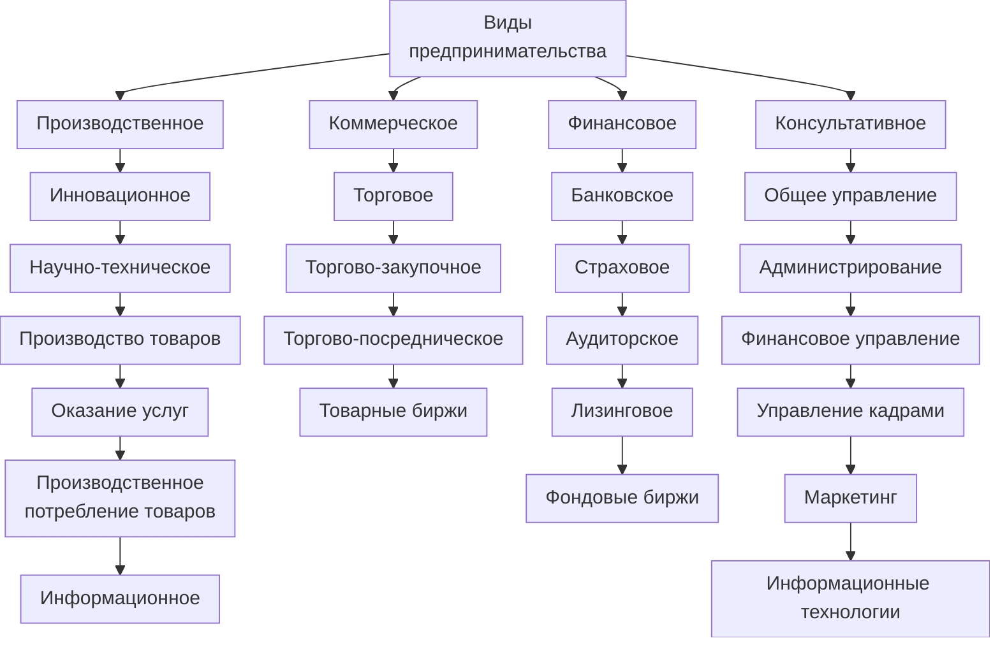
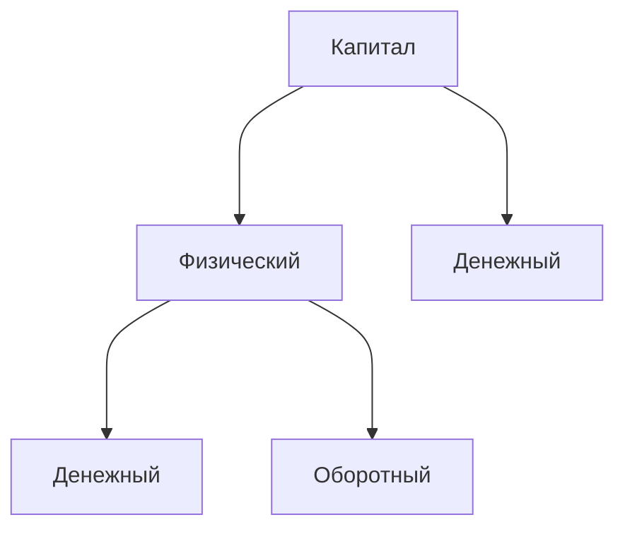
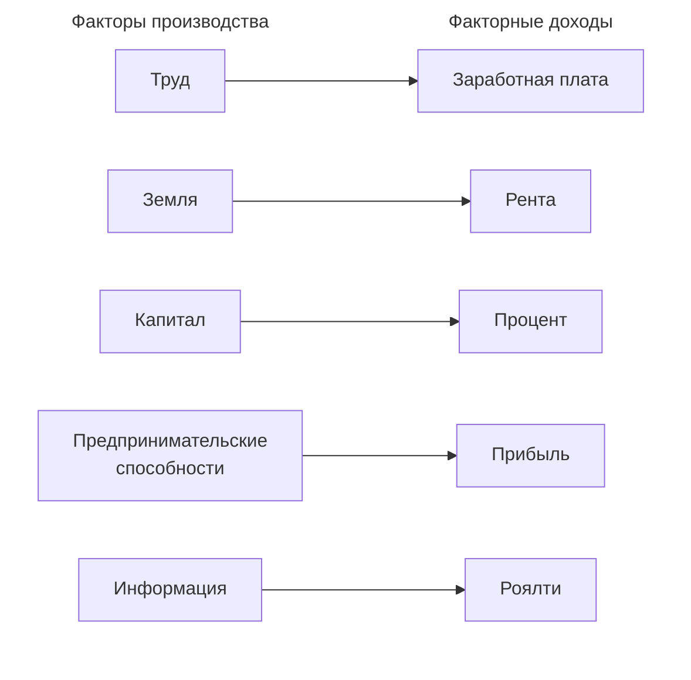

# 09.09.2025  Понятие и признаки предпринимательской деятельности (ОПД)

**Предпринимательская деятельность** (статья 2 в ГК РФ) - самостоятельная, осуществляемая на свой риск деятельность, направленная на систематическое получение прибыли от пользования имуществом, продажи товаров, выполнения работ или оказания услуг, лицами, зарегистрированные в установленном законом порядке.

На основании данного определения можно выделить признаки предпринимательской деятельности

1. Самостоятельная деятельность
2. Осуществляемая на свой риск
3. Цель – получение прибыли
4. Систематическое получение прибыли
5. Источники прибыли: пользование имуществом, продажа товаров, выполнение работ, оказание услуг.
6. Факт государственной регистрации (формальный признак, указывающий на законность действий, но обязательно. Он существует если есть предыдущие 5 пунктов)

В конституции РФ в статье 8 и 34 сказано *«Каждый имеет право на свободное использование своих способностей и имущества для предпринимательской и любой другой, не запрещенной законом, экономической деятельности»*

Принципы предпринимательской деятельности:
1. Свобода ПД
2. Юридическое равенство всех форм собственности
3. Свобода конкуренции и ограничение монополистической деятельности
4. Получение прибыли, как главная цель ПД
5. Законность и государственное регулирование ПД

Государственные способы регулировать ПД - снизить налоги (4.6% для малого бизнеса)

Первая строка показывает виды, а остальное – это подвиды, наследующие общую характеристику родителя

1. Производственное – создание услуг и другой продукции
2. Коммерческо-торговое – посредническая деятельность по продвижении созданной продукции от производителю к потребителям
3. Финансово-креативное – особый вид деятельности по образованию и использованию денежных средств на цели воспроизводимости услуг и продукции
4. Консультативное – деятельность, связанная с предоставлением советов (консультаций) и помощи по вопросам общего управления, оценки возможности 

<table>
<tr>
	<th colspan="2" style = "text-align: center">
	Предпринимательская деятельность
	</th>   
</tr>
<tr>
	<td  style = "text-align: center">Как явление</td>
	<td  style = "text-align: center">Как процесс</td>
</tr>
<tr>
	<td>Отражает всю совокупность отношений, связанных с организацией предпринимателями своего дела, с производством товаров (выполнение работ, оказание услуг) и получение желаемого результата виде прибыли (дохода)</td>     
	<td>«Цепочка» целенаправленных действий предпринимателей начиная с момента возникновения (зарождения) предпринимательской идеи и заканчивая воплощением ее в конкретной предпринимательской проект</td>
</tr>
</table>

Предприятие (ст. 132 ГК РФ) - имущественный комплекс, используемый для осуществления предпринимательской деятельности. Считается недвижимостью.

Предприятие в целом или его часть могут быть объектом купли-продажи, залога, аренды и других сделок, связанных с установлением, изменением и прекращением вещных прав.

Коммерческие организации (ст. 50 ГК РФ) – организации, преследующие извлечение прибыли в качестве основной цели своей деятельности

Некоммерческие организации (ст. 50 ГК РФ) - не имеющие извлечение прибыли в качестве такой цели и не распределяющие полученную прибыль между участниками.

# 09.09.2025  Производство - основа экономики (Экономика)

Ссылка на ролик: https://uchebnik.mos.ru/material/bf42e046-9bff-4809-b030-5ad45488551e

Ежесекундно мы пользуемся экономическими благами (любой произведенный товар от телефона до одежды). Вопросами как это произвести занимается экономика.

**Благо** – средство удовлетворения потребностей

Существуют <u>необходимые</u> (они же природные, по типу солнечного света) и <u>экономические</u> блага – производимые и доступные в меньшем объеме.

**Производство** – это процесс создания экономических благ, необходимые для удовлетворения потребностей. В процессе производства создается продукт, который в свою очередь делится на товары и услуги.

Для людей далеких от экономики понятие продукта и товара являются синонимами, но это не так. В процессе производства мы сделали продукт, и только если он является объектом купли-продажи – он становится товаром.

**Товар** – продукт труда, произведенный для обмена, путем купли-продажи.

**Услуга** – это экономическая деятельность, приносящая удовлетворение личных потребностей и общества в целом.

Услуга не обладает вещественной формой. В отличии от товара, который сначала создается, а потом продается, услуга создается в моменте.

Основной производственной ячейкой является предприятие

Предприятие (в экономике) группируются по отраслям.

Отрасль (в экономике) – это совокупность предприятий, производящих однородную продукцию или услугу. Промышленность, сельское хозяйство и т.п.

<table>
	<th colspan="2" style="text-align: center">
		Деятельность в экономике объединена в две группы.
	</th> 
	<tr>
		<td> Отрасли материального производства </td>
		<td> Отрасли социально-культурной сферы </td>
	</tr>
	 <tr>
	 <td> Промышленность, сельское и лесное хозяйство, связь, транспорт, строительство, материально-техническое обеспечение. </td>
	 <td> Наука, культура, образование, здравоохранение, социальное обеспечение, бытовое обслуживание, ЖКХ</td>
	 </tr>
</table>

<table style="width: 100%">
	<th colspan="3" style="text-align: center">
		Типы производства
	</th>
	<tr>
	<td> Единичное (штучное) </td>
	<td> Серийное </td>
	<td> Массовое (поточное) </td>
	</tr>
</table>

В процессе производства люди используют ресурсы, которые называются <u>факторами производства</u>

Каждому фактору производства соответствует фактор дохода

	<table style="">
	<th style="text-align: center">
		Факторы производства
	</th>
	<th style="text-align: center">
		Факторы дохода
	</th>
	<tr>
	<td style="width: 50%">
	1. Труд (человеческий ресурс – работник)    
	2. Земля
	3. Капитал
	4. Предпринимательские способности
	5. Информация (самый ценный ресурс)
	
	</td>
	<td style="width: 50%">
	1. Заработная плата
	2. Рента
	3. Процент
	4. Предпринимательская прибыль
	5. Прибыль
	</td>
	</tr>
	</table>

Одним из важнейших показателей эффективного использования ресурсов является производительность труда.

**Производительность труда** - это выработка в единицу времени (или время, затраченное на производство единицы продукции)

Формула расчета производительности труда

$$
\begin{align*}
 П_{пр} &= \frac{T}{Q} = \frac{Q}{T}\\
 T &\text{ - время} \\
 Q &\text{ - объем, количество}
\end{align*}
$$

Каждое предприятие стремится снизить затраты и повысить производительности труда. Для этого есть следующие способы:

1. Материально технические (новая техника, прогрессивные технологии)
2. Организационно-экономические (уровень организации труда, качество управления)
3. Разделение труда и специализация
4. Социально-психологические (повышение квалификации, стимулирование)

**Разделение труда** - разделение процесса производства на ряд отдельных операций, этапов, выполняемых разными работниками. Непосредственно связано со специализацией

**Специализация** — это форма разделения труда, которая выражается в сосредоточении деятельности на относительно узких направлениях, производственных операциях или видах выпускаемой продукции.

# 09.09.2025 Факторы производства (Экономика)

Ссылка на урок https://uchebnik.mos.ru/material/2fa15a44-7ad8-4249-bac0-14aeae866c41

Факторы перечислены были в прошлой теме, здесь более подробно

**Труд** - целесообразная деятельность людей, направленная на создание экономических благ. Труд представляет собой совокупность умственных и физических способностей занятых в производственном процессе людей, а также их профессиональных знаний, трудовых навыков и производственного опыта.

Труд бывает простой (не требующий подготовки/квалификации) и сложный (требующий специальной подготовки или квалификации)

**Земля** (как фактор производства) - это природные ресурсы, используемые в производстве: собственно земля (пахотные земли, место размещения производственных зданий, сооружений), полезные ископаемые, леса, вода, растительный и животный мир природы.

Главная проблема экономики – ограниченность ресурсов, поэтому цель – производить максимально эффективно

**Капитал** — это созданные людьми средства производства. Капитал – это все что приносит прибыль (квартиры, станки и прочее), а не деньги, который лежат мертвым грузом.

**Предпринимательские способности** - особые способности человека проявить инициативу, принять решение о производстве товара, собрать воедино необходимые факторы производства, организовать производственный процесс, взять на себя весь риск.

**Информация** — это прежде всего знания, сведения, сообщения, данные, используемые в процессе анализа и выработки экономических решений, в управлении и т. д.

**Информация** - все знания и сведения, необходимые для квалифицированной экономической деятельности.

# 12.09.2025 Личностные и профессиональные свойства предпринимателя (ОПД)

Предприниматель должен иметь достаточно глубокие познания и навыки в вопросах:
1. Закупка и продажа товаров, включая внешние
2. Вопросы маркетинга 
3. Управление и право 
4. Знание бухгалтерского учета
5. Знание финансов и налогообложения

Эти вопросы не касаются ИП - потому что это микробизнес. Налоги приходят ему как ФНС, и он платит их как процент со своих доходов (4% или 6%). Есть лимит в 1 млн., в таком случае придется оформлять ООО и т.п.

	

<u>Личные свойства предпринимателя:</u>
1. Готовность рисковать и брать за это на себя ответственность. Но рисковать надо умело. Риск не безрассудное лихачество, а строгий расчет. Умение рисковать, связано со способностью предвидеть, и просчитывать все возможные варианты.
2. Честность, надежность, верность данному слову - это требование, без которых невозможен цивилизованный рынок
3. Высокие духовные и физические качества. Надо хотеть и уметь переносить, высокие физические нагрузки, работать по 16 часов в сутки и считать это совершенно нормальным.
4. Связывать с предпринимательством не столько обогащение, сколько желание служить своему делу
5. Инициатива - искать дополнительные задачи, находчивость, смекалка
6. Дружелюбное отношение к людям, быть приятным в обхождении

<u>Этический кодекс предпринимателя (кто такой цивилизованный предприниматель):</u>
1. Убежден в полезности своего труда не только для себя, но и для других. для общества, для государства
2. Исходит из того, что люди, окружающие его, хотят и умеют работать, стремятся реализовать себя вместе с ним
3. Верит в торговый бизнес, расценивает его как привлекательное творчество, относится к торговому бизнесу, как к искусству
4. Признает необходимость конкуренции, но понимает и необходимость сотрудничества
5. Уважает себя как личность, а любую личность, как себя
6. Уважает любую собственность, государственную власть, общественные движения, социальный порядок, законы
7. Доверяет себе, но и другим, уважает профессионализм и компетентность
8. Ценит образование, науку и технику, информатику, культуру, уважает экологию
9. Стремится к нововведениям
10. Является гуманистом (человечность, любовь к людям)