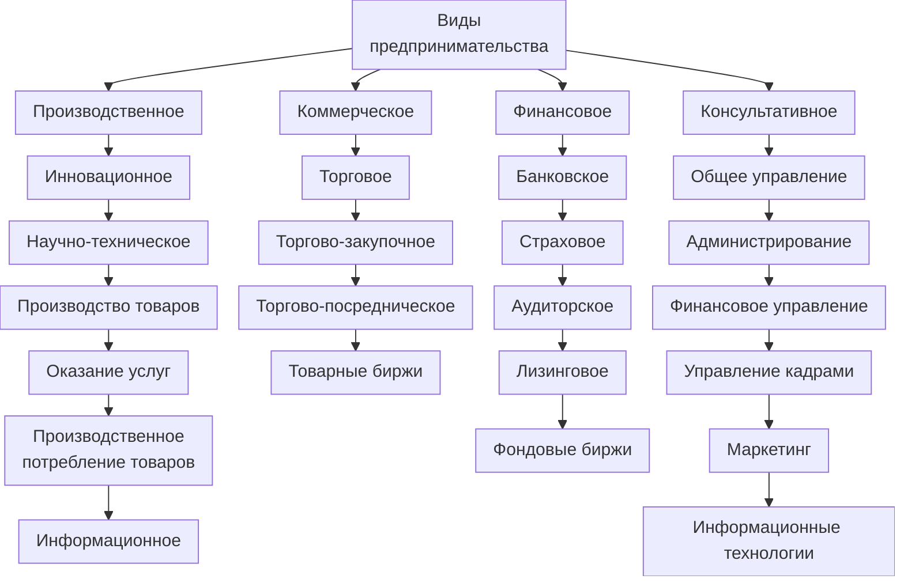
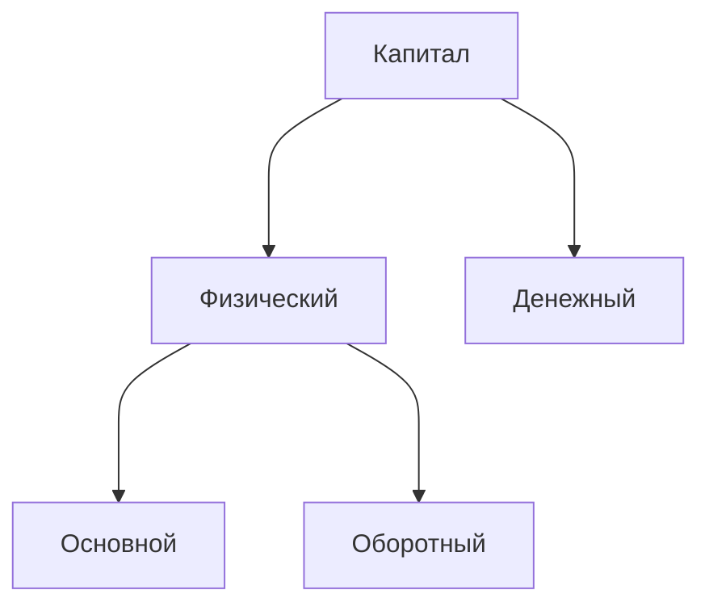
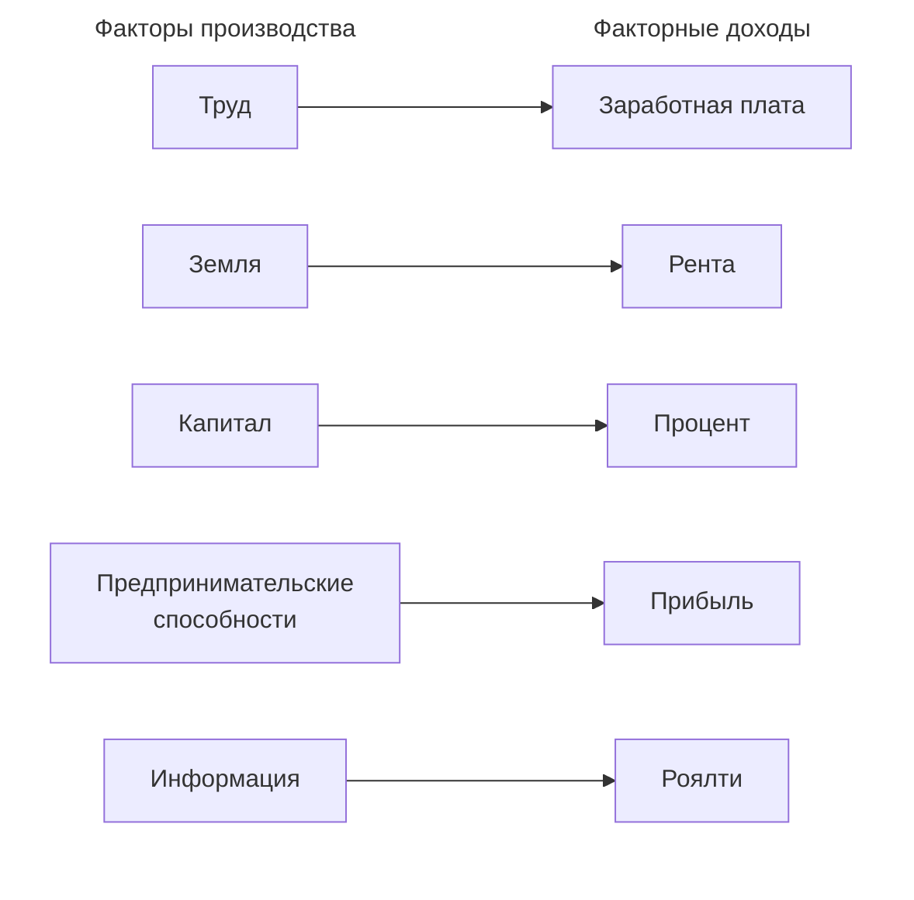
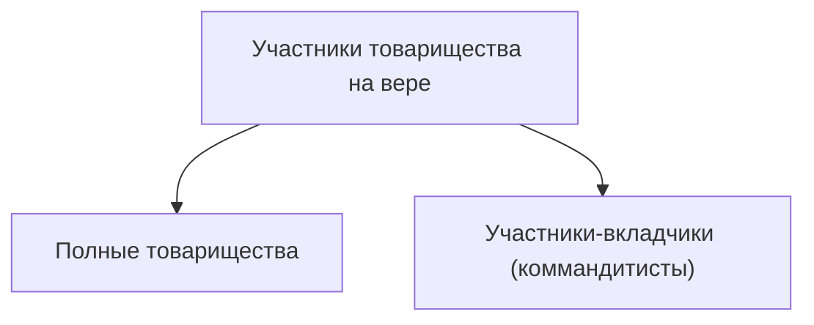
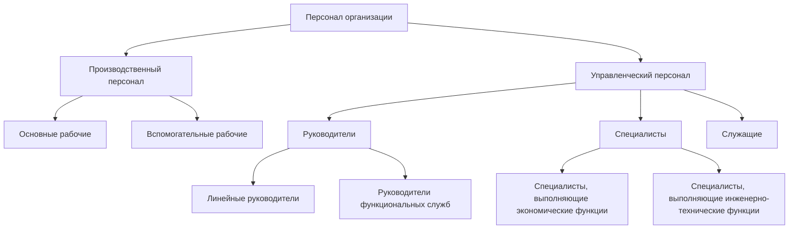

# 09.09.2025  Понятие и признаки предпринимательской деятельности (ОПД)

**Предпринимательская деятельность** (статья 2 в ГК РФ) - самостоятельная, осуществляемая на свой риск деятельность, направленная на систематическое получение прибыли от пользования имуществом, продажи товаров, выполнения работ или оказания услуг, лицами, зарегистрированные в установленном законом порядке.

На основании данного определения можно выделить признаки предпринимательской деятельности

1. Самостоятельная деятельность
2. Осуществляемая на свой риск
3. Цель – получение прибыли
4. Систематическое получение прибыли
5. Источники прибыли: пользование имуществом, продажа товаров, выполнение работ, оказание услуг.
6. Факт государственной регистрации (формальный признак, указывающий на законность действий, но обязательно. Он существует если есть предыдущие 5 пунктов)

В конституции РФ в статье 8 и 34 сказано *«Каждый имеет право на свободное использование своих способностей и имущества для предпринимательской и любой другой, не запрещенной законом, экономической деятельности»*

Принципы предпринимательской деятельности:
1. Свобода ПД
2. Юридическое равенство всех форм собственности
3. Свобода конкуренции и ограничение монополистической деятельности
4. Получение прибыли, как главная цель ПД
5. Законность и государственное регулирование ПД

Государственные способы регулировать ПД - снизить налоги (4.6% для малого бизнеса)

```mermaid
%%{init: {"flowchart": {"padding": 0, "diagramPadding": 0, "nodeSpacing": 20, "rankSpacing": 20}}}%%
graph TD
    A["Виды<br>предпринимательства"]

    %% --- Первая колонка ---
    A --> B[Производственное]
    B --> B1[Инновационное]
    B1 --> B2[Научно-техническое]
    B2 --> B3[Производство товаров]
    B3 --> B4[Оказание услуг]
    B4 --> B5["Производственное<br>потребление товаров"]
    B5 --> B6[Информационное]

    %% --- Вторая колонка ---
    A --> C[Коммерческое]
    C --> C1[Торговое]
    C1 --> C2[Торгово-закупочное]
    C2 --> C3[Торгово-посредническое]
    C3 --> C4[Товарные биржи]

    %% --- Третья колонка ---
    A --> D[Финансовое]
    D --> D1[Банковское]
    D1 --> D2[Страховое]
    D2 --> D3[Аудиторское]
    D3 --> D4[Лизинговое]
    D4 --> D5[Фондовые биржи]

    %% --- Четвертая колонка ---
    A --> E[Консультативное]
    E --> E1[Общее управление]
    E1 --> E2[Администрирование]
    E2 --> E3[Финансовое управление]
    E3 --> E4[Управление кадрами]
    E4 --> E5[Маркетинг]
    E5 --> E6[Информационные технологии]
```
Первая строка показывает виды, а остальное – это подвиды, наследующие общую характеристику родителя

1. Производственное – создание услуг и другой продукции
2. Коммерческо-торговое – посредническая деятельность по продвижении созданной продукции от производителю к потребителям
3. Финансово-кредитное – особый вид деятельности по образованию и использованию денежных средств на цели воспроизводимости услуг и продукции
4. Консультативное – деятельность, связанная с предоставлением советов (консультаций) и помощи по вопросам общего управления, оценки возможности 

<table>
<tr>
	<th colspan="2" style = "text-align: center">
	Предпринимательская деятельность
	</th>   
</tr>
<tr>
	<td  style = "text-align: center">Как явление</td>
	<td  style = "text-align: center">Как процесс</td>
</tr>
<tr>
	<td>Отражает всю совокупность отношений, связанных с организацией предпринимателями своего дела, с производством товаров (выполнение работ, оказание услуг) и получение желаемого результата виде прибыли (дохода)</td>     
	<td>«Цепочка» целенаправленных действий предпринимателей начиная с момента возникновения (зарождения) предпринимательской идеи и заканчивая воплощением ее в конкретной предпринимательской проект</td>
</tr>
</table>

Предприятие (ст. 132 ГК РФ) - имущественный комплекс, используемый для осуществления предпринимательской деятельности. Считается недвижимостью.

Предприятие в целом или его часть могут быть объектом купли-продажи, залога, аренды и других сделок, связанных с установлением, изменением и прекращением вещных прав.

Коммерческие организации (ст. 50 ГК РФ) – организации, преследующие извлечение прибыли в качестве основной цели своей деятельности

Некоммерческие организации (ст. 50 ГК РФ) - не имеющие извлечение прибыли в качестве такой цели и не распределяющие полученную прибыль между участниками.

# 09.09.2025  Производство - основа экономики (Экономика)

Ссылка на ролик: https://uchebnik.mos.ru/material/bf42e046-9bff-4809-b030-5ad45488551e

Ежесекундно мы пользуемся экономическими благами (любой произведенный товар от телефона до одежды). Вопросами как это произвести занимается экономика.

**Благо** – средство удовлетворения потребностей

Существуют <u>необходимые</u> (они же природные, по типу солнечного света) и <u>экономические</u> блага – производимые и доступные в меньшем объеме.

**Производство** – это процесс создания экономических благ, необходимые для удовлетворения потребностей. В процессе производства создается продукт, который в свою очередь делится на товары и услуги.

Для людей далеких от экономики понятие продукта и товара являются синонимами, но это не так. В процессе производства мы сделали продукт, и только если он является объектом купли-продажи – он становится товаром.

**Товар** – продукт труда, произведенный для обмена, путем купли-продажи.

**Услуга** – это экономическая деятельность, приносящая удовлетворение личных потребностей и общества в целом.

Услуга не обладает вещественной формой. В отличии от товара, который сначала создается, а потом продается, услуга создается в моменте.

Основной производственной ячейкой является предприятие

Предприятие (в экономике) группируются по отраслям.

Отрасль (в экономике) – это совокупность предприятий, производящих однородную продукцию или услугу. Промышленность, сельское хозяйство и т.п.

<table>
	<th colspan="2" style="text-align: center">
		Деятельность в экономике объединена в две группы.
	</th> 
	<tr>
		<td> Отрасли материального производства </td>
		<td> Отрасли социально-культурной сферы </td>
	</tr>
	 <tr>
	 <td> Промышленность, сельское и лесное хозяйство, связь, транспорт, строительство, материально-техническое обеспечение. </td>
	 <td> Наука, культура, образование, здравоохранение, социальное обеспечение, бытовое обслуживание, ЖКХ</td>
	 </tr>
</table>

<table style="width: 100%">
	<th colspan="3" style="text-align: center">
		Типы производства
	</th>
	<tr>
	<td> Единичное (штучное) </td>
	<td> Серийное </td>
	<td> Массовое (поточное) </td>
	</tr>
</table>

В процессе производства люди используют ресурсы, которые называются <u>факторами производства</u>

Каждому фактору производства соответствует фактор дохода

<table style="">
    <!-- Добавлена эта строка, чтобы обернуть заголовки -->
	<tr> 
		<th style="text-align: center">
			Факторы производства
		</th>
		<th style="text-align: center">
			Факторы дохода
		</th>
	</tr> <!-- И закрыт тег строки -->
	<tr>
		<td style="width: 50%">
		1. Труд (человеческий ресурс – работник)      
		2. Земля  
		3. Капитал  
		4. Предпринимательские способности  
		5. Информация (самый ценный ресурс)  
		</td>
		<td style="width: 50%">
		1. Заработная плата  
		2. Рента  
		3. Процент  
		4. Предпринимательская прибыль  
		5. Прибыль  
		</td>
	</tr>
</table>

Одним из важнейших показателей эффективного использования ресурсов является производительность труда.

**Производительность труда** - это выработка в единицу времени (или время, затраченное на производство единицы продукции)

Формула расчета производительности труда

$$
\begin{align*}
 П_{тр} &= \frac{T}{Q} = \frac{Q}{T}\\
 T &\text{ - время} \\
 Q &\text{ - объем, количество}
\end{align*}
$$

Каждое предприятие стремится снизить затраты и повысить производительности труда. Для этого есть следующие способы:

1. Материально технические (новая техника, прогрессивные технологии)
2. Организационно-экономические (уровень организации труда, качество управления)
3. Разделение труда и специализация
4. Социально-психологические (повышение квалификации, стимулирование)

**Разделение труда** - разделение процесса производства на ряд отдельных операций, этапов, выполняемых разными работниками. Непосредственно связано со специализацией

**Специализация** — это форма разделения труда, которая выражается в сосредоточении деятельности на относительно узких направлениях, производственных операциях или видах выпускаемой продукции.

# 09.09.2025 Факторы производства (Экономика)

Ссылка на урок https://uchebnik.mos.ru/material/2fa15a44-7ad8-4249-bac0-14aeae866c41

Факторы перечислены были в прошлой теме, здесь более подробно

**Труд** - целесообразная деятельность людей, направленная на создание экономических благ. Труд представляет собой совокупность умственных и физических способностей занятых в производственном процессе людей, а также их профессиональных знаний, трудовых навыков и производственного опыта.

Труд бывает простой (не требующий подготовки/квалификации) и сложный (требующий специальной подготовки или квалификации)

**Земля** (как фактор производства) - это природные ресурсы, используемые в производстве: собственно земля (пахотные земли, место размещения производственных зданий, сооружений), полезные ископаемые, леса, вода, растительный и животный мир природы.

Главная проблема экономики – ограниченность ресурсов, поэтому цель – производить максимально эффективно

**Капитал** — это созданные людьми средства производства. Капитал – это все что приносит прибыль (квартиры, станки и прочее), а не деньги, который лежат мертвым грузом.

```mermaid
graph TD;
A[Капитал] ---> B[Физический]
A[Капитал] ---> C[Денежный]
B ---> B1[Основной]
B ---> B2[Оборотный]
```

**Предпринимательские способности** - особые способности человека проявить инициативу, принять решение о производстве товара, собрать воедино необходимые факторы производства, организовать производственный процесс, взять на себя весь риск.

**Информация** — это прежде всего знания, сведения, сообщения, данные, используемые в процессе анализа и выработки экономических решений, в управлении и т. д.

**Информация** - все знания и сведения, необходимые для квалифицированной экономической деятельности.

```mermaid
graph LR
    subgraph s1 ["Факторы производства"]
        F1[Труд]
        F2[Земля]
        F3[Капитал]
        F4["Предпринимательские<br>способности"]
        F5[Информация]
    end

    subgraph s2 ["Факторные доходы"]
        D1[Заработная плата]
        D2[Рента]
        D3[Процент]
        D4[Прибыль]
        D5[Роялти]
    end

    F1 --> D1
    F2 --> D2
    F3 --> D3
    F4 --> D4
    F5 --> D5
    
    style s1 fill:none,stroke:none
    style s2 fill:none,stroke:none
```

# 12.09.2025 Личностные и профессиональные свойства предпринимателя (ОПД)

Предприниматель должен иметь достаточно глубокие познания и навыки в вопросах:
1. Закупка и продажа товаров, включая внешние затраты
2. Вопросы маркетинга 
3. Управление и право 
4. Знание бухгалтерского учета
5. Знание финансов и налогообложения

Эти вопросы не касаются ИП - потому что это микробизнес. Налоги приходят ему как ФНС, и он платит их как процент со своих доходов (4% или 6%). Есть лимит в 1 млн., в таком случае придется оформлять ООО и т.п.

	

<u>Личные свойства предпринимателя:</u>
1. Готовность рисковать и брать за это на себя ответственность. Но рисковать надо умело. Риск не безрассудное лихачество, а строгий расчет. Умение рисковать, связано со способностью предвидеть, и просчитывать все возможные варианты.
2. Честность, надежность, верность данному слову - это требование, без которых невозможен цивилизованный рынок
3. Высокие духовные и физические качества. Надо хотеть и уметь переносить, высокие физические нагрузки, работать по 16 часов в сутки и считать это совершенно нормальным.
4. Связывать с предпринимательством не столько обогащение, сколько желание служить своему делу
5. Инициатива - искать дополнительные задачи, находчивость, смекалка
6. Дружелюбное отношение к людям, быть приятным в обхождении

<u>Этический кодекс предпринимателя (кто такой цивилизованный предприниматель):</u>
1. Убежден в полезности своего труда не только для себя, но и для других. для общества, для государства
2. Исходит из того, что люди, окружающие его, хотят и умеют работать, стремятся реализовать себя вместе с ним
3. Верит в торговый бизнес, расценивает его как привлекательное творчество, относится к торговому бизнесу, как к искусству
4. Признает необходимость конкуренции, но понимает и необходимость сотрудничества
5. Уважает себя как личность, а любую личность, как себя
6. Уважает любую собственность, государственную власть, общественные движения, социальный порядок, законы
7. Доверяет себе, но и другим, уважает профессионализм и компетентность
8. Ценит образование, науку и технику, информатику, культуру, уважает экологию
9. Стремится к нововведениям
10. Является гуманистом (человечность, любовь к людям)

# 18.09.2025 Понятие предприятия. Организационно-правовые формы предприятий (Экономика)

Ссылка на урок: https://uchebnik.mos.ru/material/eab3b77c-e983-4bf5-abe8-109f7a6b17ce

Примечание: _Номера статей запомнить. Есть ссылки на них в тестах_

Определение понятию «**Предприятие**» дано в статье 48 ГК РФ.

**Юридическим лицом** признается организация, которая имеет обособленное имущество и отвечает им по своим обязательствам, может от своего имени приобретать и осуществлять гражданские права и нести гражданские обязанности, быть истцом и ответчиком в суде.

Юридическое лицо должно быть зарегистрировано в едином государственном реестре юридических лиц в одной из организационно-правовых форм, предусмотренных настоящим Кодексом.

В соответствии со статьей <u>50 ГК РФ</u> юридические лица (предприятия) могут быть:

- **Коммерческие** — преследующие извлечение прибыли в качестве основной цели своей деятельности

- **Некоммерческие** — не имеющие извлечение прибыли в качестве такой цели и не распределяющие полученную прибыль между участниками

**Организационно-правовые формы**
- Коммерческие корпоративные организации (Юридические лица)
- Хозяйственные товарищества (общество с ограниченной ответственностью и акционерное общество)
- Крестьянское (фермерское) хозяйство
- Производственный кооператив
- Государственные и муниципальные унитарные предприятия

**Полным** (по статье 69 ГК РФ) признается товарищество, участники которого (полные товарищи) в соответствии с заключенным между ними договором занимаются предпринимательской деятельностью от имени товарищества и несут ответственность по его обязательствам принадлежащим им имуществом. В полном товариществе участники не только отвечают за долги товарищества своим имуществом, но и отвечают солидарно, друг за друга: «Один за всех и все за одного»

**Товариществом на вере / коммандитным товариществом** (по статье 82 ГК РФ) признается товарищество, в которое наряду с участниками, осуществляющими от имени товарищества предпринимательскую деятельность и отвечающими по обязательствам товарищества своим имуществом (полными товарищами), имеется один или несколько участников-вкладчиков (коммандитистов), которые несут риск убытков, связанных с деятельностью товарищества, в пределах сумм внесенных ими вкладов и не принимают участия в осуществлении товариществом предпринимательской деятельности

```mermaid
graph TD;
	A[Участники товарищества на вере] --> B[Полные товарищества]
	A --> C["Участники-вкладчики (коммандитисты)"]
```

**Крестьянским / фермерским хозяйством** (по статье 86.1 ГК РФ) признается добровольное объединение граждан на основе членства для совместной производственной или иной хозяйственной деятельности в области сельского хозяйства, основанной на их личном участии и объединении членами крестьянского (фермерского) хозяйства имущественных вкладов.

**Обществом с ограниченной ответственностью** (по статье 87 ГК РФ) признается хозяйственное общество, уставный капитал которого разделен на доли; участники общества с ограниченной ответственностью не отвечают по его обязательствам и несут риск убытков, связанных с деятельностью общества, в пределах стоимости принадлежащих им долей.

**Акционерным обществом** (по статье 96 ГК РФ) признается хозяйственное общество, уставный капитал которого разделен на определенное число акций; участники акционерного общества (акционеры) не отвечают по его обязательствам и несут риск убытков, связанных с деятельностью общества, в пределах стоимости принадлежащих им акций.

Высший орган акционерного общества – **собрание акционерного общества**.

Основные виды акционерных обществ:

- **Публичные акционерные общества** – размещает ценные бумаги в открытой подписке. Например, может продавать их через биржу и любой может их купить

 - **Непубличные акционерные общества** – не продает свои акции на бирже, как правило распространяет их среди участников акционерного общества или по заранее оговоренному списку лиц

Основным видом ценной бумаги является **_акция._**

**Акция** — ценная бумага, выпускаемая акционерным общество, удостоверяющая членство в обществе и дающая право на получение части прибыли общества в виде дивиденда.

**Облигация** — ценная бумага, содержащая обязательство акционерного общества оплатить в установленный срок ее стоимость и фиксированную сумму процента.

Акции бывают двух видов:

- **Простые** – владельцам таких акций не гарантирован доход, но они имеют право голоса на собраниях акционерного общества

- **Привилегированные** – владельцам этого вида акций доход гарантирован, но они не имеют права голоса на собраниях акционерного общества. В случае если в этом году мы не можем выплатить владельцам дивиденды, то переносим их на следующий год и прибавляем к дивидендам следующего года. А в этом году даем право голоса на собраниях акционерного общества

В случае если в этом году мы не можем выплатить им дивиденды, переносим дивиденды на следующий год и приплюсовываем к дивидендам следующего года, а в этом году даём им право голоса на собраниях акционерного общества.

**Производственным кооперативом / артелью** (по статье 106.1 ГК РФ) признается добровольное объединение граждан на основе членства для совместной производственной или иной хозяйственной деятельности <u> (производство, переработка, сбыт промышленной, сельскохозяйственной и иной продукции, выполнение работ, торговля, бытовое обслуживание, оказание других услуг) </u>, основанной на их личном трудовом и ином участии и объединении его членами (участниками) имущественных паевых взносов

Пай - часть, доля участия в товариществе, акционерном обществе. Паевым взносом члена кооператива могут быть деньги, ценные бумаги, иное имущество, в том числе и имущественные права.

Число членов кооператива: не менее 5

	

**Унитарным предприятием** (по статье 113 ГК РФ) признается коммерческая организация, не наделенная правом собственности на закрепленное за ней собственником имущество. 

Имущество унитарного предприятия является неделимым и не может быть распределено по вкладам (долям, паям), в том числе между работниками предприятия.

Имущество унитарного предприятия принадлежит ему на праве хозяйственного ведения или оперативного управления.

Гражданин вправе заниматься предпринимательской деятельностью без образования юридического лица с момента государственной регистрации в качестве **индивидуального предпринимателя.**

Граждане вправе заниматься производственной или иной хозяйственной деятельностью в области сельского хозяйства без образования юридического лица на основе соглашения о создании крестьянского (фермерского) хозяйства, заключенного в соответствии с законом о крестьянском (фермерском) хозяйстве. Главой крестьянского (фермерского) хозяйства может быть гражданин, зарегистрированный в качестве индивидуального предпринимателя (Статья 23 ГК РФ)

# 29.09.2025 Персонал организации: понятие и классификация (Экономика)
**Персонал организации** — это сотрудники организации, работающие по найму и обладающие определенными профессиональными и качественными характеристиками. Существенным признаком персонала организации является оформление трудового договора с работодателем.

С практической точки зрения персонал организации представляет собой важнейший ресурс организации. В теории менеджмента персонал организации рассматривается в качестве ее социальной системы. Ведущая роль в обеспечении выполнение стратегических целей организации принадлежит персоналу организации.

Требования, предъявляемые по реализации целей для достижения тех или иных экономических результатов, способность решать и выполнять стратегические задачи по развитию организации и повышению ее конкурентоспособности, прямо связаны с уровнем самоорганизации системы. Социальная система организации закономерно разделяются на две основные подсистемы управляющую и управляемую.

**Персонал** — это личный состав организации, включающий всех наемных работников, а также работающих собственников и совладельцев.

**Человеческие ресурсы** - понятие, отражающее главное богатство любого общества, процветание которого возможно при создании условий для воспроизводства, развития, использования этого ресурса с учетом интересов каждого человека.

**Трудовой потенциал работника** — это совокупность физических и духовных качеств человека, определяющих возможность и границы его участия в трудовой деятельности, способность достигать в заданных условиях определенных результатов, а также совершенствоваться в процессе труда.

Численность персонала организации зависит от характера, масштаба, сложности, трудоемкости производственных и управленческих процессов, степени их механизации, автоматизации, компьютеризации.

Персонал организации подразделяют на управленческий персонал и производственный персонал.

```mermaid
graph TD
    A[Персонал организации] --> B[Производственный персонал]
    A --> C[Управленческий персонал]
    
    B --> D[Основные рабочие]
    B --> E[Вспомогательные рабочие]
    
    C --> F[Руководители]
    C --> G[Специалисты]
    C --> H[Служащие]
    
    F --> I[Линейные руководители]
    F --> J[Руководители функциональных служб]
    
    G --> K[Специалисты, выполняющие экономические функции]
    G --> L[Специалисты, выполняющие инженерно-технические функции]
```

**Управленческий персонал** - часть персонала организации, выполняющая общие функции управления: планирование, организацию, мотивацию и контроль.

**Производственный персонал** занят непосредственно на производстве и участвует в осуществлении технологического процесса.

По характеру трудовых функций персонал подразделяется на:
1.	рабочих;
2.	руководителей;
3.	специалистов;
4.	служащих.

В зависимости от уровня управления руководители бывают:

- **линейные**;

- **функциональные.**

Линейные возглавляют организацию в целом или ее подразделения. Функциональные руководители возглавляют отделы, службы, бюро и т.д. Линейный руководитель осуществляет непосредственное руководство людьми и производственной деятельностью. Он является связывающим звеном между руководством организации, которое разрабатывает стратегические задачи управления, и непосредственными исполнителями, которые реализуют эти решения. Правильный подбор линейного руководителя имеет особое значение. Линейный руководитель обязательно должен иметь профессиональную подготовку и опыт деятельности.

**Специалисты** - лица, осуществляющие экономические, инженерно- технические, юридические и другие функции. Специалисты имеют высшее или среднее специальное образование.

**Служащие** осуществляют подготовку и оформление документов, учет, контроль, хозяйственное обслуживание. Квалификационные требования к служащим: среднее профессиональное образование или среднее полное образование, с подготовкой по специальной программе в течение одного или нескольких месяцев.

**Работники подразделяются по:**

- профессиям;

- специальностям;

- квалификации.

**Профессия** представляет вид трудовой деятельности, требующий для выполнения специальных теоретических знаний и практических навыков, приобретаемых в СПТУ или ПТУ.

**Специальность** представляет собой одно из направлений профессии (токарь-настройщик, слесарь по ремонту оборудования и т.д.)

**Квалификация работника** определяется уровнем специальных знаний, практических навыков и характеризует степень сложности выполняемых работ. Уровень квалификации оценивается разрядами, которые устанавливаются по тарифно-квалификационным справочникам.

Квалификацию работников по статусу в занятости определяют на:

- наемных работников, заключивших трудовой договор об условиях трудовой деятельности, за которую они получают плату наличными деньгами или натурой. К ним относятся лица, избранные, назначенные или утвержденные на оплачиваемую должность;

- работников, занятых индивидуальной деятельностью, приносящей им доход, но не использующих труд наемных работников;

- работодателей-собственников организаций, которые свои функции могут делегировать наемному менеджеру:

- неоплачиваемых работников семейных предприятий;

- членов коллективных организаций (кооперативов, колхозов и т.д.);

- лиц, не поддающихся квалификации по статус

Наемных работников подразделяют на:

- гражданское население;

- военнослужащих.

По длительности найма их подразделяют на:

- постоянных работников;

- временных работников;

- сезонных работников.

Работа имеет квалификацию:

- основную;

- дополнительную;

- неполную видимую занятость.

**Основная работа** - та, на которой у администрации находится трудовая книжка работника.

Для более полной классификации персонала необходимо рассматривать:

- профессиональную структуру;

- квалификационную структуру;

- половозрастную структуру;

- структуру персонала по стажу;

- структуру персонала по уровню образования.

Все это в совокупности можно понимать, как трудовой потенциал организации, который зависит от принципов управления персонала.

**Принципы управления персоналом** — это фундаментальные основы управления.

Важнейшими принципами управления персоналом являются:

- системность;

- демократизация;

- индивидуализация;

- информатизация;

- достижения поставленных целей перед организацией;

- подбор работников с учетом их психологической совместимости;

- учет пожеланий сотрудников при выборе форм и методов их переподготовки и повышения квалификации.

**Принцип системности в работе** с персоналом предполагает, что управление персоналом в организации должно:

- охватывать не отдельные категории работающих, а весь состав персонала; 

- решать не одномоментные задачи, а непрерывно возникающие проблемы в деятельности работника: от его приема на работу, в период продвижения по службе и до его последнего дня работы в организации;

- использовать разные методы, средства, приемы работы с персоналом, а не случайно принятое под влиянием настроения решение.

**Принцип демократизации работы** с персоналом означает:

- демократичность в методах управления и стиле руководства;

- участие в оценке каждого работника коллектива того подразделения, в котором он работает;

- регулярное выявление мнения сотрудников по важнейшим проблемам деятельности организации и учет этого мнения при разработке мероприятий по решению данных проблем;

- внедрение нововведении с согласия персонала организации;

- партисипативное управление, т. е. вовлечение в процесс управления организацией рядовых сотрудников через их участие в кружках качества, общественных бюро экономического анализа и др.;

- повышение информированности работников о результатах и перспективах производственно-хозяйственной деятельности организации.

**Принцип индивидуализации работы** с персоналом реализуется в:

- индивидуальном планировании профессионального и должностного роста работников;

- индивидуальном подходе к мотивации труда исполнителей;

- персональном подборе состава работников с учетом способностей и индивидуальных особенностей личности.

**Принцип информатизации работы** с персоналом предполагает применение современных средств вычислительной техники для процедур сбора, передачи, обработки, хранения, выдачи информации в целях оперативного принятия обоснованных кадровых решений. Этому способствует оснащение кадровых служб персональными компьютерами и создание на их базе автоматизированных рабочих мест работников кадровой службы.

# 03.10.2025 Рабочее время и его использование, Характеристика производительности труда персонала, Мотивация труда, Тарифная система оплаты труда (Экономика)

**1. Понятие рабочего времени и его использование**

**Рабочее время** — это время, в течение которого работник должен выполнить свои обязанности на рабочем месте.

Рабочее время делится:

**Нормальное (регламентированное)** - время, установленное законодательством или трудовым договором (обычно 40 часов в неделю).

**Фактически отработанное** - время, реально затраченное на выполнение работы.

Использование рабочего времени характеризуется:

**Полезным временем** - время, непосредственно затраченное на выполнение производственных операций.

**Неполезным временем** - время простоев, ожиданий, организационных перерывов и т. д.

Для повышения эффективности используют методы анализа использования рабочего времени (например, процент полезного времени к общему рабочему времени).

**2. Производительность труда персонала и факторы, влияющие на производительность**

**Производительность труда** — это количество продукции или объема услуг произведенных сотрудником за единицу времени. К основным характеристикам производительности труда относится:

**Материальная производительность** - результат в натуральном выражении (количество изделий, отработанных часов и т. д.).

**Трудовая производительность** - отношение объема выполненной работы к затратам рабочего времени.

Факторы, влияющие на производительность труда:

- квалификация и опыт работников;

- организация труда и условия работы;

- использование современной техники и технологий;

- мотивация персонала и трудовая дисциплина.

Для оценки производительности труда применяют показатели:

- выработка на одного человека;

- выработка на час рабочего времени;

- коэффициент использования рабочего времени.

Эффективное использование рабочего времени напрямую влияет на производительность труда. Повышение производительности труда возможно через оптимизацию рабочего времени, улучшение организации труда и повышения квалификации персонала.

**3. Мотивация труда персонала, с целью повышения производительности**

**Мотивация труда** - внутреннее и внешнее побуждение человека к выполнению трудовых функций.

**Цель мотивации** - стимулировать сотрудников работать более эффективно и качественно.

Виды мотивации:

- **Внутренняя (внутренняя удовлетворенность)** — это интерес к содержанию работы, признание, самореализация.

- **Внешняя мотивация** — это материальное вознаграждение, премии, повышение, социальные гарантии.

Методы мотивации труда:

- **Материальное стимулирование:** повышение заработной платы, премии, бонусы, социальные льготы.

- **Нематериальное стимулирование:** похвала, карьерный рост, обучение, создание комфортных условий.

- **Организационные меры:** улучшение условий труда, четкая постановка задач, участие в принятии решений.

**Влияние мотивации на производительность труда**

Эффективная мотивация приводит к:

- увеличению объема и качества выполненной работы;

- снижению ошибок и простоев;

- росту инициативы и ответственности сотрудников;

- повышению квалификации и общего уровня дисциплины.

Для значительного повышения производительности труда необходимо гармоничное сочетание материальных и нематериальных методов мотивации с учетом индивидуальных потребностей работников и созданием благоприятных условий труда.

**4. Тарифная система оплаты труда**

**Тарифная система** — это способ оплаты труда, основанный на установлении тарифных ставок (процентов) за единицу времени или объема работы. Чаще всего тарифная система применяется на предприятиях с постоянным видом деятельности и ясной классификацией профессий. Она включает в себя тарифные сетки и категории, распределяющие работников по квалификации и сложности выполняемых задач.

Основными элементами тарифной системы являются:

- **Тарифная ставка** — это фиксированная сумма за час, день или месяц работы.

- **Тарифная сетка** — это иерархическая структура ставок, сгруппированных по разрядам и категориям.

- **Тарифные разряды** — это уровни квалификации работников, определяющие размер оплаты.

Преимущества тарифной системы оплаты труда:

- обеспечение справедливой и прозрачной оплаты;

- стимулирование повышения квалификации работников;

- удобство при организации труда с типовыми задачами.

# 08.10.2025 Предпринимательская идея. Методы генерации бизнес-идей

**Идея** – это четкое представление о том, как и путем каких конкретных действий предпринимателя потребность потенциального покупателя может быть удовлетворена.

**Задача предпринимателя** – вовремя определить еще только возникающую, но перспективную потребность, что означает преуспевание на рынке не только сегодня, но и завтра.

**Предпринимательская идея имеет две особенности:**

•	без ее наличия предпринимательская деятельность вообще невозможна;

•	любой функционирующий предприниматель в своей деятельности не может избежать процесса накопления, отбора и сравнительного анализа предпринимательских идей.

Итак, **предпринимательская идея** – это выявленная предпринимателем новая форма экономической активности, в которой совмещаются потенциальные или реальные потребности рынка в определенных услугах (или товарах) с возможностями предпринимателя произвести эти услуги (товары) и получить дополнительный доход от нововведения (инновации). Деятельность предпринимателя предполагает создание базы идей, которые могли бы составить основной или дополнительный профиль производства услуг или посредничества. Накопление идей может иметь как текущий, так и перспективный характер. По каждой идее предприниматель принимает решение – приступать или не приступать к ее практической реализации.

Общий алгоритм создания собственного дела, можно выразить следующей краткой схемой:

**предпринимательская идея - цели предпринимателя - разработка предпринимательского проекта - реализация его в виде создания собственного дела функционирование организации.**

Разработка идей не является основной профессиональной деятельностью предпринимателя. Но предпринимателем может быть лишь тот, кто способен на новые идеи или по крайней мере чуток к их восприятию.

Под источником предпринимательских идей понимают объективное условие, развитие которого в определенном направление приведет к производству новых (в целом для предпринимательства) товаров, продуктов или услуг.

Любой бизнес начинается с **генерации идей** для бизнеса. Генерация идей – сложный процесс, и чтобы добиться результатов, нужно владеть различными креативными техниками. Применение таких методов, а также представление о том, как происходит формирование новых идей – залог развития творческих способностей, которые так необходимы современным специалистам.  

Генерация идей является неотъемлемой частью практической и творческой деятельности людей. С их помощью создаются новые полезные объекты или уничтожаются вредные, а также модифицируются уже существующие. Идеи помогают достигнуть намеченных целей на пути развития личности или коллектива.

**Рассмотрим методики, которые помогают искать оригинальные и полезные идеи для бизнеса:**

1.	**«Мозговой штурм»** — это коллективная генерация идей, когда группа людей предлагает различные идеи, участники группы пытаются их развивать, выявляя недостатки и преимущества.

2.	**«Синектика»**. Выбирается объект и составляется таблица для его аналогий. В первом столбце – прямые аналоги, во втором – косвенные (к примеру, признаки первого столбца). В конце сопоставляются цель, объект и косвенные аналогии.

3.	**«Шесть шляп»**. По очереди надеваются шесть шляп разного цвета. В белой проверяются цифры и факты, в черной – отрицательные черты, в желтой – анализируются положительные моменты, в зеленой – происходит генерация идей, в красной – позволяются активные эмоциональные реакции, в синей – подводятся итоги генерации идей для бизнеса.

4.	**«Морфологический анализ»**. Исследуемый бизнес-объект раскладывается на компоненты, из которых отбираются самые значимые характеристики. Затем их следует изменить и попытаться снова собрать вместе. В результате получаем новый объект.

5.	**«Расшифровка»**. Берется любая надпись на иностранном языке, например, иероглифы. У разгадывающего надпись, в этот момент могут рождаться в голове самые различные ассоциации.

6.	**«Непрямые стратегии»** Для этого метода генерации идей для бизнеса требуются карточки с командами («дай волю злости», «укради решение» и др.). Участвующие вытаскивают карты и выполняют указания.

7.	**«Ловушка для идей»**. Фиксируются абсолютно все идеи для бизнеса, можно их записывать на диктофон или в тетрадь. А потом при случае возвращаться к ним.

8.	**«Ментальные карты»**. В центр листа заносится ключевое понятие идеи для бизнеса, а все ассоциации, которые следует запомнить, записываются на ветвях, идущих от него. Идеи для бизнеса можно рисовать. Создание подобной карты способно помочь придумать новые ассоциации.

# 08.10.2025 ПРАВИЛА СОЗДАНИЯ МЕНТАЛЬНОЙ КАРТЫ
**Интеллектуальная карта (майнд-карта, интеллект-карта, ментальная карта, Mind Map) — это инструмент для организации и визуализации идей, задач и другой информации, которую необходимо структурировать.**

В бизнесе этот метод используют для мозговых штурмов, определения и постановки задач, составления плана презентаций, публичных выступлений и многого другого. Инструмент можно применять в том числе в вопросах, которые не связаны с бизнесом напрямую: например, для организации корпоративного мероприятия или визуализации идей подарков для сотрудников.

**Ментальные карты обладают следующими преимуществами:**

✅ **Чёткая структура**. В схеме отражена взаимосвязь всех элементов.

✅ **Наглядность**. Визуализация помогает лучше воспринимать и запоминать информацию.

✅ **Простота**. Модель несложно составить, а в процессе работы можно добавлять новые элементы, приписывать детали, отмечать прогресс.

✅ **Повышение продуктивности**. Инструмент помогает эффективно структурировать задачи, сокращает время на поиск информации.

Минусы:

❌ **Ограниченный объём**. Нужно вписывать данные в кратком виде, чтобы они помещались в блоках. Из-за этого есть риск потерять какие-то детали.

❌ **Неоднозначность**. Не каждый легко воспринимает визуальные образы. Некоторых сотрудников громоздкая схема может, напротив, запутать.

**Как составить ментальную карту**

Тони Бьюзен в своей книге «Интеллект-карты» предлагает следующие шаги для создания ментальной карты, которая будет работать на вас:

1. **Возьмите лист бумаги и в центре напишите тему, которую хотите изучить**. Рядом с темой нарисуйте символ, подходящий по смыслу. Картинка включит воображение и вызовет ассоциации.

2. **Нарисуйте первую ветвь, которая отходит от центральной темы**. Важно, чтобы она была изогнута: такая форма наиболее привлекательна для мозга и повышает вероятность запоминания информации.

3. **Напишите ключевую идею, связанную с центральной темой**. Желательно, чтобы это было короткое название из одного-двух слов. Используйте для создания карты хотя бы два цвета: так вы будете запоминать лучше. Вербальную информацию обрабатывает левое полушарие, а цвет воспринимает правое — сочетание слов и цвета заставляет активно работать обе части мозга.

4. **Дорисуйте второстепенные ветви**. Подпишите их словами или комбинацией слов и символов. Если создаёте карту с идеями, нарисуйте ветви и оставьте их пустыми. Это стимулирует мозг придумать, чем их заполнить.

5. **Дорисуйте остальные ветви, отходящие от центральной темы**. Не забывайте выделять слова цветом или символами для лучшего запоминания.

	

# 16.10.2025 Выбор системы налогообложения (ОПД)

**1. Понятие системы налогообложения**

**Система налогообложения** — это совокупность налогов и сборов, взимаемых в установленном порядке.
Основы действующей в настоящее время системы налогообложения (Российской Федерации) были заложены в 1992 году. В это время был принят пакет законов Российской Федерации об отдельных видах налогов и сборов, основные принципы которых сохранены.

Законодательной основой построения налоговой системы Российской Федерации является Налоговый кодекс, а также принятые в соответствии с ним федеральные законы о налогах и сборах, законодательные акты субъектов Российской Федерации.

Выбор режима налогообложения - важный этап для эффективного ведения бизнеса. Правильный выбор снижает налоговую нагрузку и упрощает бухгалтерский учет.

**2. Основные режимы налогообложения**

**Общая система налогообложения (ОСН)**

ОСН подходит для крупных компаний. Есть обязательство платить НДС, налог на прибыль, налог на имущество. Требует полноценного бухгалтерского учета. Подходит при высокой выручке и больших расходах.

**Упрощенная система налогообложения (УСН)**

Наиболее популярный и простой режим для малого и среднего бизнеса. Есть два варианта:

1) 6% - с доходов без учета расходов

2) 15% - с доходов минус расходы.

Выбор зависит от соотношения доходов и расходов. Если бизнес небольшой и расходы малые - выбирают УСН 6% с доходов. Если расходы крупные - УСН 15% с доходов минус расходы.

**Патентная система налогообложения (ПСН)**

ПСН применяется для индивидуальных предпринимателей и субъектов малого бизнеса. Применяется только к определенным видам деятельности. Налог фиксированный и рассчитывается в виде стоимости патента.

**Единый налог на вмененный доход (ЕНВД)**

Сейчас большинство регионов РФ отказались от него, но в некоторых еще действует. Расчет налога строится на предполагаемом доходе, а не фактическом. ЕНВД применяется для некоторых видов торговли и услуг.

**Налог на профессиональный доход (НПД)**

Этот вид один из самых простых среди других режимов. Но он подойдет для небольшого бизнеса. Например, если предприниматель сам оказывает услуги.

Лимиты: годовой доход ИП должен быть не больше 2,4 млн. рублей. Также предприниматель не может нанимать сотрудников для работы. Платит только налоги по одной из двух налоговых ставок:

1) 4% - если работает с физическими лицами;

2) 6% - если работает с юридическими лицами и другими ИП.

Выбор режима налогообложения влияет на финансовые результаты и административные процессы. Важно оценивать специфику бизнеса, консультироваться со специалистами и своевременно менять режим налогообложения по мере роста компании.

# 16.10.2025 Заработная плата (Экономика)

Самым первичным побудительным мотивом деятельности человека служит его потребность в средствах к жизни. Источником удовлетворения этой потребности признается материальное вознаграждение за труд, представляющее собой часть стоимости созданного трудом продукта.

Заработная плата, являясь важной и сложной категорией, тесно связана со всеми стадиями воспроизводства (постоянного возобновления факторов производства по мере их расходования).

В соответствии со ст. 129 Трудового Кодекса РФ **заработная плата (оплата труда работника)** - вознаграждение за труд в зависимости от квалификации работника, сложности, количества, качества и условий выполняемой работы, а также компенсационные выплаты (доплаты и надбавки компенсационного характера, в том числе за работу в условиях, отклоняющихся от нормальных, работу в особых климатических условиях и на территориях, подвергшихся радиоактивному загрязнению, и иные выплаты компенсационного характера) и стимулирующие выплаты (доплаты и надбавки стимулирующего характера, премии и иные поощрительные выплаты).

Регулирование заработной платы должно осуществляться таким образом, чтобы обеспечивалось опережение роста производительности труда по сравнению с ростом заработной платы.

Различают **номинальную (денежную) и реальную** заработную плату.

**Номинальная заработная плата** подразделяется на начисленную (причитающуюся работнику за выполненную работу в определенном периоде) и выплаченную (полученную работником на руки после вычета всех налогов).

**Реальная заработная плата** - сумма благ и услуг, которые можно приобрести за определенную денежную заработную плату при данном уровне цен на товары и услуги.

Иными словами, реальная заработная плата «покупательная способность» номинальной заработной платы. При повышении номинальной на 15% и инфляции за этот период в 10% реальная заработная плата увеличится только на 5%.

Превышение инфляции по сравнению с ростом номинальной заработной платы приводит к снижению реальной, и наоборот. При отсутствии инфляции рост номинальной заработной платы означает такой же рост реальной.

В трудовом законодательстве оговорено, что вид, системы оплаты труда, размеры тарифных ставок, окладов, премий, иных поощрительных выплат, за также соотношения в их размерах между отдельными категориями персонала предприятия, учреждения, организации определяют самостоятельно и фиксируют их в коллективных договорах, иных локальных нормативных актах.

Оплата труда работников состоит из двух частей:

1)	**основной заработной платы.** К ней относится оплата, начисляемая работникам за отработанное время, количество и качество выполненных работ: оплата по сдельным расценкам, тарифным ставкам, окладам, премии сдельщикам и повременщикам, доплаты в связи с отклонениями от нормальных условий работы, за работу в ночное время, за сверхурочные, за бригадирство, оплата простоев не по вине рабочих и т. п.;

2)	**дополнительной заработной платы.** К ней относятся выплаты за непроработанное время, предусмотренные законодательством по труду: оплата очередных отпусков, перерывов в работе, кормящих матерей, льготных часов подростков, выходного пособия при увольнении и др.

**Тарифная ставка** - фиксированный размер оплаты труда работника за выполнение нормы труда определенной сложности (квалификации) за единицу времени без учета компенсационных, стимулирующих и социальных выплат.

**Оклад (должностной оклад)**- фиксированный размер оплаты труда работника за исполнение трудовых (должностных) обязанностей определенной сложности за календарный месяц без учета компенсационных, стимулирующих и социальных выплат.

**Базовый оклад (базовый должностной оклад)**, базовая ставка заработной платы - минимальные оклад (должностной оклад), ставка заработной платы работника государственного или муниципального учреждения, осуществляющего профессиональную деятельность по профессии рабочего или должности служащего, входящим B соответствующую профессиональную квалификационную группу, без учета компенсационных, стимулирующих и социальных выплат.

Практикуются следующие формы и системы заработной платы:

**- повременная (простая и премиальная системы);**

**- сдельная (простая и премиальная системы, сдельно-прогрессивная, аккордная, косвенно-сдельная).**

**Повременная з/плата может быть простой и повременно-премиальной.**

**При простой повременной системе** оплаты труда размер з/платы зависит от тарифной ставки или оклада и отработанного времени.

**Знов. = Ст час. x t факт.;**

**Зпов. = Ст.мес. х Дфакт. / Дил.**

где - **Дпл., Дфакт.** - количество дней по плану и отработанных фактически.

**При повременно-премиальной системе** оплаты труда работник сверх з\платы (тарифа, оклада) за фактически отработанное время дополнительно получает премию. Она связана с результативностью того или иного подразделения или предприятия в целом, а также с вкладом работника в общие результаты труда.

**Зпов.-прем. = Зпов. + Зпов. х % прем. / 100%**

**Сдельная форма оплаты труда подразделяется: прямую сдельную косвенную сдельную; сдельно-премиальную; сдельно-прогрессивную; аккордную.**

**При прямой сдельной системе** оплаты труда размер з/платы определяется по формуле:

**Зед. = P x Vраб.**
где **P**- расценка или размер оплаты труда за единицу выполненной работы, руб.

Расценка за единицу выполненной работы определяется исходя из норм выработки или норм времени:

**P = Ст час. / Нвыр.час;**

**P = Ст час. х Нврем.**

**При косвенно-сдельной системе** оплаты труда размер з/платы работника зависит от результатов тех работников, которых он обслуживает. Она используется для оплаты труда вспомогательных рабочих и рассчитывается по формуле:

**3 косв.-сд. = Ст час. х tфакт х k в.н.**

где **tфакт** - фактически отработанное время в календарном периоде, час. 

**k в.н.** - коэффициент выполнения норм выработки основными рабочими.

**При сдельно-премиальной системе** оплаты труда размер з/платы работника зависит не только от прямого сдельного заработка, но и от размера премии, которая выплачивается за достижение количественных и качественных показателей деятельности предприятия: 

**Зед-прем. = Зед. + (Зед х %прем. ) / 100%**

**При прогрессивно-сдельной системе** оплаты труда в пределах установленных норм выработки выплачиваются обычные расценки, а при перевыполнении установленных норм - повышенные (полуторные или двойные).

**Зед.-прог. = Рплан. х Уплан. + Рповыш. х Vраб. сверхил.**

**При аккордной системе** оплаты труда расценка устанавливается не за единицу продукции, а за весь объем работы с определением конечного срока выполнения. Наиболее часто эта система применяется в строительстве, при срочных ремонтах, при устранении аварий.

Форма оплаты труда на предприятии может быть как **бригадная**, так и **индивидуальная**. Для более полного учета трудового вклада каждого рабочего в результаты труда бригады с согласия ее членов могут использоваться **коэффициенты трудового участия (КТУ) и коэффициенты трудового вклада (КТВ)**.

Месячная оплата труда работников не может быть ниже минимального размера оплаты труда, установленного законодательством.
